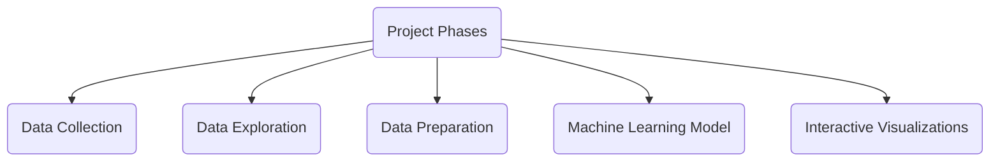

### Welcome to the Data Science Roadmap!

###### The Data Science Roadmap presented here serves as a comprehensive guide on GitHub, designed to provide a clear and structured path to face a problem in the field of data science. It is intended to be utilized as a valuable resource, enabling individuals to navigate the ever-evolving landscape of data science with ease. This roadmap breaks down the key areas of data science into easy-to-follow sections organized in folders. From fundamental concepts to advanced topics, every section of this roadmap has been carefully crafted to cover essential aspects of data science.

###### In this work the main phases of a data science project are presentes and organized as follows,

[comment]: <> ('theme': 'forest','themeVariables': {'primaryColor': "#ffcccc",'secondaryColor': "#fff0cc",'tertiaryColor': "#fff0f0" })


[comment]: <> (--------------------------------------------------------------------------------------------------)
<details><summary>1. Data Collection</summary>
<p>
  
###### SQL, which stands for Structured Query Language, is a fundamental tool used in data science for managing and manipulating structured data stored in relational databases. It provides a standardized way to interact with databases and extract valuable insights from large datasets. Although SQL languages all share a basic structure, some of the specific commands and styles can differ slightly. Popular dialects include MySQL, SQLite, SQL Server, Oracle SQL, and more. 
 
* ##### What the query looks like
    * ###### SELECT --> FROM --> WHERE --> GROUP BY --> HAVING --> ORDER BY --> LIMIT
* ##### How it is executed
    * ###### FROM --> WHERE --> GROUP BY --> HAVING --> SELECT --> ORDER BY --> LIMIT    

    <details>
    <summary>Subsection 1.1</summary>
        
    ##### Where
        
    ###### The SQL WHERE clause is used to filter data based on specific conditions in a SELECT, UPDATE, or DELETE statement. It allows you to specify a condition that must be met for a row to be included in the result set or for an action to be performed.

    ```
    SELECT column1, column2, ...
    FROM table_name
    WHERE condition;
    ```
     
</p>
</details>

[comment]: <> (--------------------------------------------------------------------------------------------------)
<details><summary>2. Data Exploration</summary>
<p>
  
  * Descriptive Statistics
    *  Qualitative Variables
    *  Quantitative Variables 
  * Data Visualization
    *  Line,plots
    *  scatter plots
    *  boxplots
    *  histograms
    *  heatmaps
    *  corplots
    *  bubble maps
  
</p>
</details>

[comment]: <> (--------------------------------------------------------------------------------------------------)
<details><summary>3. Data Preparation</summary>
<p>
  
  * Handling missing values
  * Outlier detection
  * Feature Engineering 
  * Feature projection techniques 
  * Feature selection
  * Balancing data
  * Splitting data
  
</p>
</details>

[comment]: <> (--------------------------------------------------------------------------------------------------)
<details><summary>4. Machine Learning Models</summary>
<p>
  
  * Supervised Learning 
    *  Ex
  * Unsupervised Learning 
  * Forecasting time series 
  
</p>
</details>

[comment]: <> (--------------------------------------------------------------------------------------------------)
<details><summary>5. Interactive Visualizations</summary>
<p>
  
  * Supervised Learning 
    *  Ex
  * Unsupervised Learning 
  * Forecasting time series 
  
</p>
</details>


