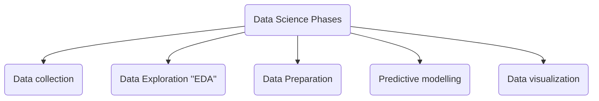

### Welcome to the Data Science Roadmap!

###### The Data Science Roadmap presented here serves as a comprehensive guide on GitHub, designed to provide a clear and structured path to face a problem in the field of data science. It is intended to be utilized as a valuable resource, enabling individuals to navigate the ever-evolving landscape of data science with ease. This roadmap breaks down the key areas of data science into easy-to-follow sections organized in folders. From fundamental concepts to advanced topics, every section of this roadmap has been carefully crafted to cover essential aspects of data science.

###### In this work the main phases of a data science project are presentes and organized as follows,

Data collection

  
  * Extracting information from exiting databases using SQL
  

Data Exploration ''EDA'' 

  
  * Descriptive Statistics
    *  Qualitative Variables
    *  Quantitative Variables 
  * Data Visualization
    *  Line,plots
    *  scatter plots
    *  boxplots
    *  histograms
    *  heatmaps
    *  corplots
    *  bubble maps
  

Data Preparation

  
  * Handling missing values
  * Outlier detection
  * Feature Engineering 
  * Feature projection techniques 
  * Feature selection
  * Balancing data
  * Splitting data
  

Predictive modelling

  
  * Supervised Learning 
    *  Ex
  * Unsupervised Learning 
  * Forecasting time series 
  

Data visualization

  
  * Supervised Learning 
    *  Ex
  * Unsupervised Learning 
  * Forecasting time series 
  

